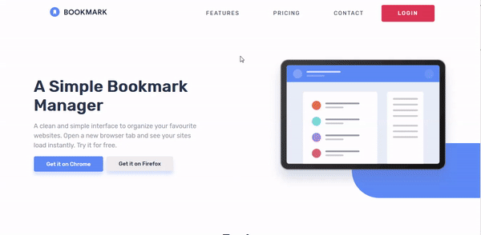

<h1 align="center">
   🔖 Frontend Mentor - Bookmark Landing Page
</h1>

 <a href="#about">About</a> • 
 <a href="#tech-stack">Tech Stack</a> •   
 <a href="#author">Author</a>

## About
This is a project to acomplish a Fronend Mentor challenge.
The challenge can be found [here](https://www.frontendmentor.io/challenges/bookmark-landing-page-5d0b588a9edda32581d29158).  
[See live demo](https://allangpio.github.io/bookmark-landing-page/)

## Tech Stack

- HTML
- CSS
- SASS
- JavaScript

## Author
---

<b>Allan Gaia Pio</b>

Made by Allan Gaia Pio 👋🏽 Get in touch!

 

